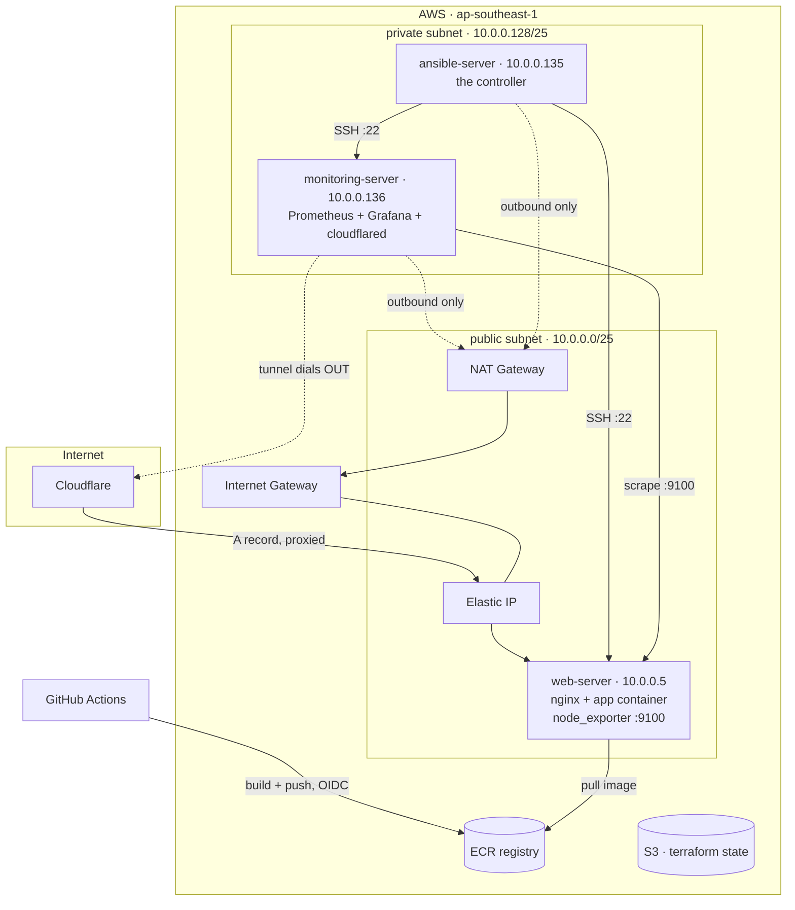

# DevOps Bootcamp — Final Project

A containerised website deployed to AWS entirely from code, with metrics
collection and two different routes to the public internet.

Terraform builds the network and servers. Ansible — running from a controller
*inside* the private subnet — configures them. The application is built into a
Docker image, stored in a private ECR registry, and served by nginx. Prometheus
and Grafana watch the web server, and Grafana is published without opening a
single inbound port.

---

## Live URLs

| | URL | How it is reached |
|---|---|---|
| **Application** | <https://web.haqqki.com> | Cloudflare proxy → Elastic IP → nginx container on the web server |
| **Monitoring** | <https://monitoring.haqqki.com> | Cloudflare Tunnel → Grafana container, with no inbound port open |
| **Repository** | <https://github.com/wanedri/devops-bootcamp-project> | Public source for everything described here |

This page is published from `README.md` by GitHub Actions and lives at
<https://wanedri.github.io/devops-bootcamp-project/>.

---

## Architecture



Traffic to the application arrives through Cloudflare and the Elastic IP.
Traffic to Grafana never arrives at all — `cloudflared` dials *outward* through
the NAT gateway and holds the connection open, so the monitoring server needs no
inbound rule beyond SSH from inside the VPC.

## Reference values

| Resource | Name | Value |
|---|---|---|
| Region | — | `ap-southeast-1` |
| VPC | `devops-vpc` | `10.0.0.0/24` |
| Public subnet | `devops-public-subnet` | `10.0.0.0/25` |
| Private subnet | `devops-private-subnet` | `10.0.0.128/25` |
| Gateways | `devops-igw` · `devops-ngw` | — |
| Route tables | `devops-public-route` · `devops-private-route` | — |
| Security groups | `devops-public-sg` · `devops-private-sg` | — |
| Web server | `web-server` | `10.0.0.5` + Elastic IP |
| Ansible controller | `ansible-server` | `10.0.0.135` |
| Monitoring server | `monitoring-server` | `10.0.0.136` |
| State bucket | `devops-bootcamp-terraform-adri` | S3, versioned, AES256 |
| Image registry | `devops-bootcamp/final-project-adri` | ECR |

### Firewall rules

| Group | Inbound |
|---|---|
| `devops-public-sg` | `80` from anywhere · `22` from `10.0.0.0/24` · `9100` from `10.0.0.136/32` |
| `devops-private-sg` | `22` from `10.0.0.0/24` — nothing else |

Port `9100` is restricted to the monitoring server's exact address, not the whole
private subnet, so the controller cannot reach the metrics endpoint either.

## Repository layout

```
terraform/
  providers.tf        S3 backend with native locking, AWS + local providers
  network.tf          VPC module: subnets, IGW, single NAT, route tables
  security.tf         the two security groups
  ec2.tf              three instances, pinned private IPs
  iam.tf              one role per instance, least privilege
  ecr.tf              private image registry
  inventory.tf        renders the Ansible inventory from real state
  inventory.ini.tftpl the inventory template
  outputs.tf          IPs, Elastic IP, registry URLs
  variables.tf        region, name suffix, secret parameter paths

ansible/
  ansible.cfg
  inventory.ini       generated by Terraform — do not edit by hand
  group_vars/all.yml  registry, hostnames, scrape targets
  requirements.yml    Galaxy roles and collections
  site.yaml           runs all four playbooks in order
  playbook-common.yaml    base packages + AWS CLI
  playbook-app.yaml       Docker, pull from ECR, run the site
  playbook-exporter.yaml  node_exporter on the web server
  playbook-stack.yaml     Prometheus + Grafana + cloudflared
  compose.yaml            the monitoring stack
  prometheus.yaml.j2      scrape config, templated
  grafana/provisioning/   data source and dashboard providers

app/
  Dockerfile          multi-stage: Node build → nginx runtime
  dockerignore

.github/workflows/
  pages.yml           render README.md and publish it to GitHub Pages
  ci.yml              validate Terraform, Ansible and the image on every push
  deploy.yml          build and push to ECR via OIDC
```

## Prerequisites

- An AWS account with the state bucket already created (Terraform cannot create
  the bucket that holds its own state)
- An EC2 key pair named `wan-adri-key` — this project imports an existing
  `ed25519` public key rather than letting AWS generate one
- Two SecureString parameters in SSM Parameter Store:
  - `/devops-bootcamp-2026/ansible-ssh-key` — the private key, so the controller
    can reach its targets
  - `/devops-bootcamp-2026/tunnel-token` — the Cloudflare Tunnel token
- A Cloudflare zone for `haqqki.com`
- A GitHub repository variable `AWS_ROLE_ARN`, set from
  `terraform output github_actions_role_arn`, so the deployment workflow can
  authenticate

## Deploying

### 1. Build the infrastructure

```bash
cd terraform
terraform init
terraform apply
```

This also writes `ansible/inventory.ini` from the real deployed addresses.

### 2. Commit the generated inventory

```bash
git add ansible/inventory.ini && git commit -m "generated inventory" && git push
```

The controller obtains this repository by `git clone`, not by running Terraform,
so the inventory has to be in the remote before the next step.

### 3. Reach the controller

The controller has no public address and no inbound SSH from the internet.
Access is through Session Manager:

```bash
INSTANCE=$(aws ec2 describe-instances --region ap-southeast-1 \
  --filters "Name=tag:Name,Values=ansible-server" \
            "Name=instance-state-name,Values=running" \
  --query 'Reservations[].Instances[].InstanceId' --output text)

aws ssm start-session --target "$INSTANCE" --region ap-southeast-1
sudo su - ubuntu
```

### 4. Prepare the controller

```bash
sudo apt update && sudo apt install -y unzip curl ansible git
curl -fsSL "https://awscli.amazonaws.com/awscli-exe-linux-x86_64.zip" -o /tmp/awscliv2.zip
cd /tmp && unzip -q awscliv2.zip && sudo ./aws/install && hash -r

mkdir -p ~/.ssh && chmod 700 ~/.ssh
aws ssm get-parameter --name /devops-bootcamp-2026/ansible-ssh-key \
  --with-decryption --query Parameter.Value --output text \
  --region ap-southeast-1 > ~/.ssh/id_ed25519
chmod 600 ~/.ssh/id_ed25519
ssh-keygen -y -f ~/.ssh/id_ed25519      # must print the public key
```

Install the AWS CLI from the official archive rather than snap — the snap build
corrupts binary-ish output when redirected to a file, which silently mangles the
private key.

### 5. Run the playbooks

```bash
cd ~ && git clone https://github.com/wanedri/devops-bootcamp-project.git
cd devops-bootcamp-project/ansible
ansible-galaxy install -r requirements.yml
ansible all -m ping
ansible-playbook site.yaml
ansible-playbook site.yaml      # second run must report changed=0
```

### 6. Publish

| Hostname | Method |
|---|---|
| `web.haqqki.com` | Cloudflare **A** record → the Elastic IP, **proxied**, SSL/TLS mode **Flexible** |
| `monitoring.haqqki.com` | Cloudflare Tunnel public hostname → service `http://grafana:3000` |

SSL/TLS must be **Flexible**: the origin listens on port 80 only, so Full would
have Cloudflare attempting HTTPS against a port nothing is serving.

## Continuous integration and delivery

Three GitHub Actions workflows. None of them stores an AWS access key.

### `pages.yml` — publish this README as a public page

The required pipeline. On every push that changes `README.md`, the workflow
renders it to HTML and publishes it to GitHub Pages. No HTML is committed and no
step is manual — the published page is always whatever the README currently
says, which is the point: documentation that cannot drift from its source.

`scripts/render-readme.mjs` does the conversion. One wrinkle it handles: GitHub
renders ` ```mermaid ` fences natively in the README view, but a plain Markdown
converter emits them as escaped code blocks. The script rewrites those into
`<pre class="mermaid">` with the source unescaped, and the page loads Mermaid
from a CDN, so the architecture diagram above survives publication.

Build it locally to see exactly what CI will publish:

```bash
npm install && npm run docs:build     # writes site/index.html
```

Enable it once under **Settings → Pages → Source → GitHub Actions**.

### `ci.yml` — on every push and pull request

| Job | What it checks |
|---|---|
| `terraform` | `fmt -check`, then `init -backend=false` + `validate`. Never touches the real S3 state. |
| `ansible` | Installs the Galaxy dependencies and syntax-checks every playbook against a throwaway inventory. |
| `image` | Builds the application image and then *runs* it, curling port 80 to prove it serves. |

The image job also exercises the application's own pre-flight gate, because
`npm test` runs inside the Docker build — an invalid `ship.config.json` fails CI
rather than reaching the registry.

### `deploy.yml` — on push to `master` affecting `app/`

Builds the image and pushes it to ECR with two tags: the commit SHA, so any
build can be identified and rolled back to, and `latest`, which is what
`playbook-app.yaml` deploys.

### Authentication

The workflow assumes `devops-github-actions-role` using an OIDC token rather
than stored credentials. AWS verifies the token came from this repository via
the trust policy's `sub` condition, then issues temporary credentials scoped to
pushing this one ECR repository.

Setting it up requires one value in GitHub:

```bash
terraform output github_actions_role_arn
```

Add it under **Settings → Secrets and variables → Actions → Variables** as
`AWS_ROLE_ARN`. It belongs in *Variables* rather than *Secrets* — a role ARN is
not sensitive, and the trust policy is what provides the security, not the
obscurity of the ARN.

Only one OIDC provider for GitHub may exist per AWS account. If the account
already has one, set `create_github_oidc_provider = false` and Terraform looks
up the existing provider instead of trying to create a second.

### Order of operations

The image must exist in ECR before `playbook-app.yaml` runs, because that
playbook pulls rather than builds. On a first deployment, let `deploy.yml`
finish before running the playbooks.

## Design decisions

**Session Manager instead of a bastion host.** The controller sits in the private
subnet with no public IP and no inbound SSH from the internet. Reaching it via a
jump host would mean exposing port 22 on the web server and managing another hop;
SSM opens an outbound-initiated session using the instance's IAM role instead, so
there is nothing extra to expose or maintain.

**One IAM role per instance rather than one shared role.** Each server gets only
what its job requires:

| Role | Permissions |
|---|---|
| `devops-web-role` | SSM core · ECR push and pull |
| `devops-ansible-role` | SSM core · read *one* SSM parameter (the SSH key) |
| `devops-monitoring-role` | SSM core · read *one* SSM parameter (the tunnel token) · `kms:Decrypt` restricted to SSM |

The controller cannot read the tunnel token, and the monitoring server cannot
read the SSH key. `kms:Decrypt` is constrained by a `kms:ViaService` condition so
those roles can only decrypt *through* SSM, not against arbitrary keys.

**Secrets are read at runtime, never through Terraform.** An
`aws_ssm_parameter` *data source* would decrypt the value and write it into the
state file in plaintext — and that state file lives in S3. Instead the playbooks
fetch secrets on the target machine using its own instance role, so no secret is
ever present in state, in the repository, or on a laptop.

**The tunnel, not an open port.** Grafana could have been exposed by publishing
port 3000 and adding a security group rule. Instead `cloudflared` runs beside
Grafana in the same Compose network and establishes an outbound connection to
Cloudflare. Grafana is reachable at `monitoring.haqqki.com` while the monitoring
server's only inbound rule remains SSH from inside the VPC.

**The image is built in CI, not on the server.** GitHub Actions builds and
pushes it; the web server only pulls and runs. This keeps the build reproducible
(same runner image every time, rather than whatever state the server drifted
into), gives every image a commit-SHA tag, and means the web server's IAM role
needs ECR *read* only. A production web server that can overwrite its own image
in the registry is a blast radius with no upside.

**GitHub authenticates by OIDC, not access keys.** The deployment workflow
assumes an IAM role by presenting a short-lived token that AWS verifies came
from this specific repository. There are no AWS credentials stored in GitHub —
only the role ARN, which is not sensitive. The trust policy's `sub` condition
(`repo:owner/name:*`) is what stops any other repository from assuming it.

**Multi-stage Docker build.** The build stage carries the full Node toolchain to
produce `dist/`; the runtime stage is nginx plus the built assets and nothing
else. The result is roughly 75 MB with no `node_modules`, no npm and no source.
The build also runs the application's own pre-flight test, so an invalid
`ship.config.json` fails the image rather than shipping a broken site.

**Bind mount for configuration, named volume for data.** `prometheus.yaml` is
bind-mounted from the host, because Ansible manages it and it should be
overwritten on every run. Grafana's database lives in the `grafana-data` named
volume, because it must survive the container being replaced.

**Private IPs are pinned.** Fixing the addresses in Terraform means the
Prometheus scrape target, the `9100` firewall rule and the inventory all stay
valid across a rebuild.

**The inventory is generated, not written by hand.** `inventory.tf` renders it
from the real deployed values, so it cannot drift from what actually exists.

**Idempotency is deliberate.** The image rebuilds only when the checkout or
Dockerfile changed; the push is skipped unless the build produced something new;
`docker compose up -d` reports changed only when compose actually started or
recreated a container; the ECR login is marked `changed_when: false`. A second
`site.yaml` run reports zero changes.

## Verifying

```bash
# the application
curl -sI https://web.haqqki.com | head -1

# the image reached the registry
aws ecr list-images --repository-name devops-bootcamp/final-project-adri \
  --region ap-southeast-1

# metrics are being collected (from the controller)
ansible monitoring -b -a "docker ps"
ansible web -b -a "curl -s localhost:9100/metrics | head -1"

# the monitoring server has no inbound exposure
aws ec2 describe-security-groups --region ap-southeast-1 \
  --filters "Name=group-name,Values=devops-private-sg" \
  --query 'SecurityGroups[].IpPermissions'
```

Grafana can also be reached without the tunnel, for debugging:

```bash
aws ssm start-session --target <monitoring-instance-id> \
  --document-name AWS-StartPortForwardingSession \
  --parameters '{"portNumber":["3000"],"localPortNumber":["3000"]}' \
  --region ap-southeast-1
```

## Screenshots

Evidence that each part of the system is doing what this document claims. Files
live in `docs/img/`.

| # | Capture | Shows |
|---|---|---|
| 1 | `web.haqqki.com` in a browser, padlock visible | The application served over HTTPS through Cloudflare |
| 2 | Grafana dashboard at `monitoring.haqqki.com` with live graphs | Metrics flowing end to end, reached through the tunnel |
| 3 | Prometheus targets page showing `10.0.0.5:9100` as **UP** | The scrape path works |
| 4 | `devops-private-sg` inbound rules in the AWS console | Port 22 only — no inbound exposure on the monitoring server |
| 5 | GitHub Actions runs, all green | CI and the Pages publish succeeding |
| 6 | ECR repository listing the pushed image | The image pipeline reached the registry |
| 7 | Second `ansible-playbook site.yaml` run ending `changed=0` | Idempotency |

<!--
Once the files are in docs/img/, paste these in place of this comment:

### The application


### Grafana


### Prometheus targets


### No inbound exposure


### Pipelines


### Registry


### Idempotent second run

-->

## Operational notes

**The Elastic IP changes on every rebuild.** `terraform destroy` releases it, so
the Cloudflare A record for `web.haqqki.com` must be updated after each
`terraform apply`, or managed by the Cloudflare provider.

**Grafana's admin password resets on every rebuild.** It lives in the
`grafana-data` volume, which is destroyed with the instance. The default is
`admin` / `admin` and Grafana prompts for a change at first login.

**Teardown.** The NAT gateway and the two Elastic IPs bill by the hour whether or
not anything is running:

```bash
cd terraform && terraform destroy
```

Because the private IPs are pinned and the inventory is generated, rebuilding
later reproduces the same addresses and the same inventory.
